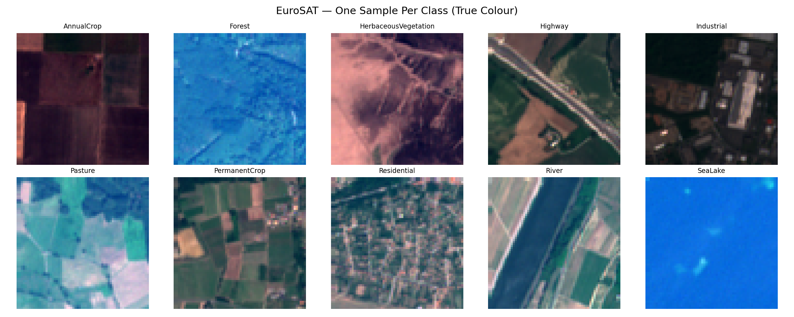
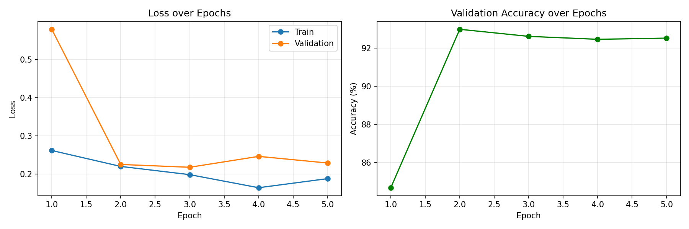
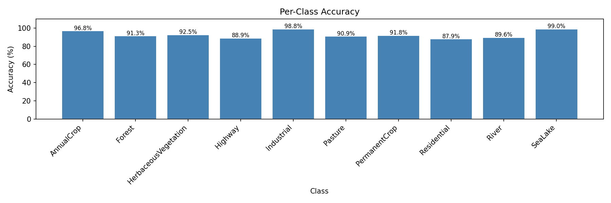
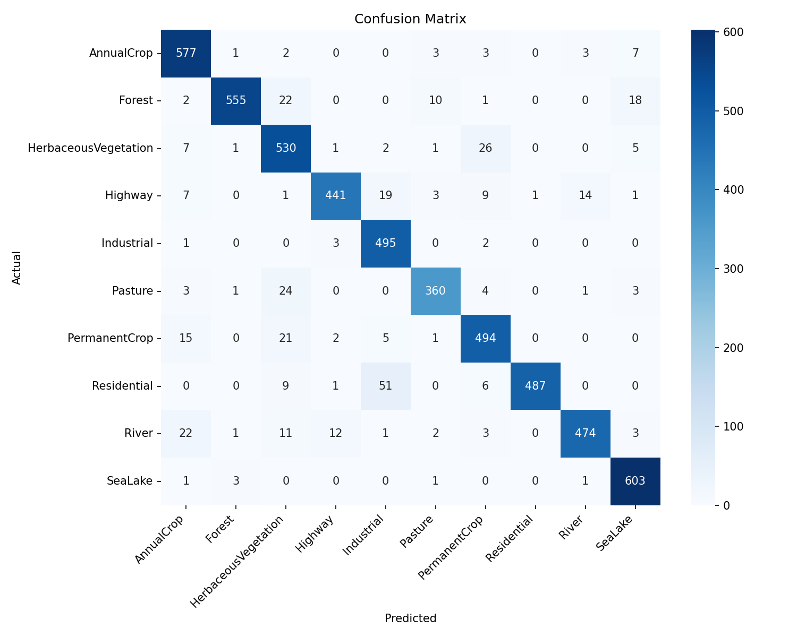
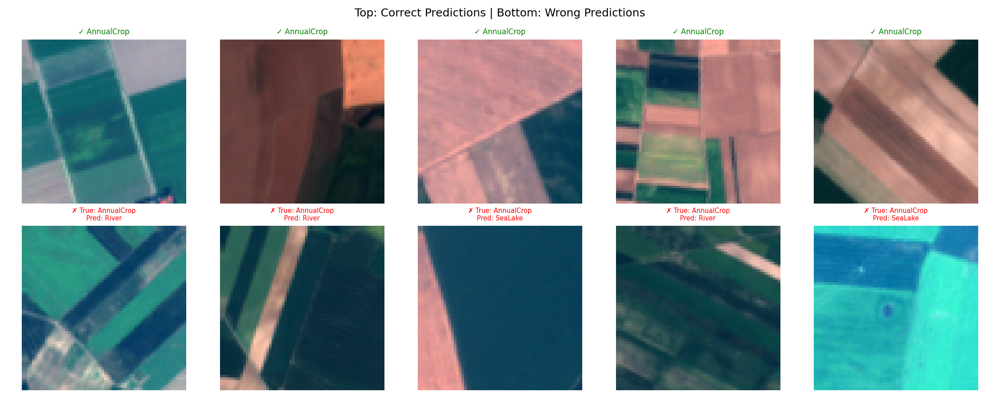
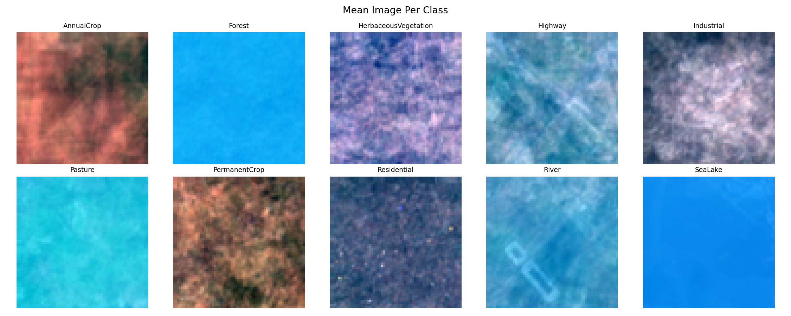
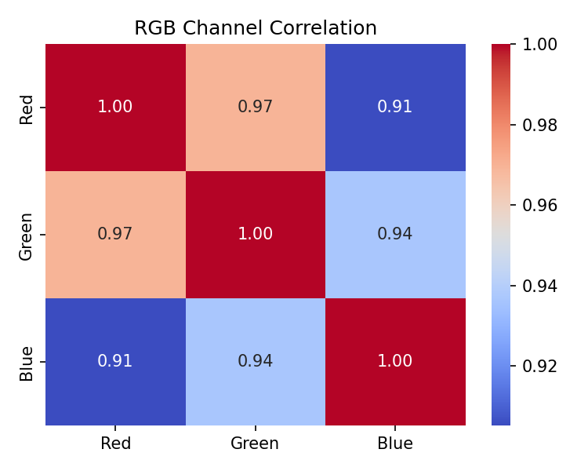
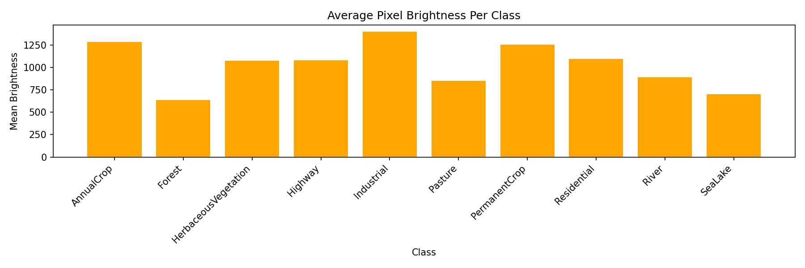
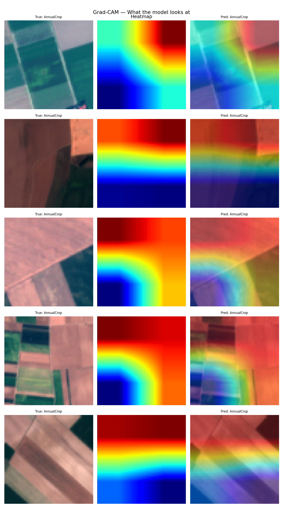

# 🛰️ Satellite Scene Classification using ResNet-18

<div align="center">


**Classifying satellite image patches into land-use categories using deep learning**

[🚀 Live Demo](https://satellite-scene-classification-4remxga6jkwsfybr79ivjq.streamlit.app) • [📓 Notebook](notebooks/satellite_classification.ipynb) • [📊 Results](#-results)

</div> 

--

## 👥 Team

| Member | Role |
|--------|--------|
| fidalgovind  | Preprocessing, Modelling, Grad-CAM, Deployment |
| Adithyan Biju | Data Loading, Data Understanding, EDA Support |
| Archana T | EDA, Evaluation, Documentation |

**Course:** Predictive Analytics

--

## 📌 Problem Statement

Satellite imagery provides a powerful view of our planet, but manually classifying land-use types is time-consuming and expensive. This project builds a deep learning model to automatically classify satellite image patches into 10 land-use categories using the EuroSAT dataset.

**Real-world applications:**
- 🏙️ Urban planning and city growth tracking
- 🌳 Deforestation and forest cover monitoring
- 🌊 Flood and water body detection
- 🌾 Agriculture monitoring for food security
- 🛣️ Infrastructure development tracking

---

## 📦 Dataset

**EuroSAT** — Based on Sentinel-2 satellite imagery

| Property | Value |
|----------|-------|
| Total images | 16,200 |
| Image size | 64 × 64 pixels |
| Spectral bands | 13 (we use RGB bands 3, 2, 1) |
| Classes | 10 |
| Split | 80% train / 10% val / 10% test |

**Classes:**

| Class | Images |
|-------|--------|
| AnnualCrop | 1,791 |
| Forest | 1,787 |
| HerbaceousVegetation | 1,799 |
| Highway | 1,505 |
| Industrial | 1,492 |
| Pasture | 1,195 |
| PermanentCrop | 1,481 |
| Residential | 1,863 |
| River | 1,460 |
| SeaLake | 1,827 |



---

## 🔄 Project Pipeline

All 10 stages of the data science lifecycle are covered:

```
Stage 1  → Problem Definition & Literature Review
Stage 2  → Data Collection & Understanding
Stage 3  → Data Preprocessing & Cleaning
Stage 4  → Exploratory Data Analysis
Stage 5  → Feature Engineering (NDVI)
Stage 6  → Model Building (ResNet-18)
Stage 7  → Model Evaluation & Comparison
Stage 8  → Model Interpretation (Grad-CAM)
Stage 9  → Deployment (Streamlit)
Stage 10 → Documentation (README, PPT, GitHub)
```

---

## 🏗️ Model Architecture

```
Input Image (64×64 RGB)
        ↓
[ ResNet-18 Backbone ]
  - Conv1 → BN → ReLU → MaxPool
  - Layer1: 2× BasicBlock (64 filters)
  - Layer2: 2× BasicBlock (128 filters)
  - Layer3: 2× BasicBlock (256 filters)
  - Layer4: 2× BasicBlock (512 filters)
  - AdaptiveAvgPool
        ↓
[ Custom FC Layer ]
  512 → 10 (land-use classes)
        ↓
[ Softmax Output ]
        ↓
Predicted Land-Use Class + Confidence
```

**Training Configuration:**

| Parameter | Value |
|-----------|-------|
| Pretrained | Yes (ImageNet) |
| Loss Function | CrossEntropyLoss |
| Optimizer | Adam |
| Learning Rate | 0.001 |
| Epochs | 5 |
| Batch Size | 32 |
| Total Parameters | ~11.2M |



---

## 🧪 Feature Engineering

**NDVI (Normalized Difference Vegetation Index)**

```
NDVI = (NIR - Red) / (NIR + Red)

+1.0 → Dense vegetation (Forest, Crops)
 0.0 → Sparse vegetation
-1.0 → Water, roads, buildings
```

NDVI was computed using Sentinel-2 Band 7 (NIR) and Band 3 (Red) to help the model better distinguish vegetation from non-vegetation land types.


---

## 📊 Results

### Overall Performance

| Metric | Value |
|--------|-------|
| **Overall Accuracy** | **92.89%** |
| Hamming Loss | 0.0711 |
| Macro F1 Score | 0.93 |
| Weighted F1 Score | 0.93 |

### Per-Class Accuracy

| Class | Accuracy |
|-------|----------|
| 🌊 SeaLake | 99.0% |
| 🏭 Industrial | 98.8% |
| 🌾 AnnualCrop | 96.8% |
| 🌿 HerbaceousVegetation | 92.5% |
| 🌳 Forest | 91.3% |
| 🐄 Pasture | 90.9% |
| 🌱 PermanentCrop | 91.8% |
| 🏘️ Residential | 87.9% |
| 🛣️ Highway | 88.9% |
| 🏞️ River | 89.6% |



### Confusion Matrix



### Key Observations
- SeaLake achieves 99% — water bodies are visually very distinct
- Industrial achieves 98.8% — unique structural patterns
- Residential (87.9%) is hardest — similar appearance to Industrial areas
- Highway (88.9%) sometimes confused with River due to linear structures

### Correct vs Wrong Predictions



---

## 📈 Exploratory Data Analysis

### Class Distribution


### Mean Image Per Class



### RGB Channel Correlation



### Average Brightness Per Class



---

## 🔍 Model Explainability — Grad-CAM

Gradient-weighted Class Activation Mapping (Grad-CAM) was used to visualise which regions of the satellite image the model focuses on when making predictions.

- 🔴 **Red/warm areas** = high attention (model focused here)
- 🔵 **Blue/cool areas** = low attention (model ignored these)

This confirms the model is learning meaningful visual features rather than random patterns.



---

## 🚀 Live Deployment

The model is deployed as an interactive web application on Streamlit Community Cloud.

**🔗 Live URL:** [https://satellite-scene-classification-4remxga6jkwsfybr79ivjq.streamlit.app](https://satellite-scene-classification-4remxga6jkwsfybr79ivjq.streamlit.app)

**Features:**
- Upload any satellite image patch (PNG, JPG, JPEG)
- Get top 3 predicted land-use classes with confidence scores
- Visual confidence bar charts
- Instant results


---

## 🗂️ Repository Structure

```
satellite-scene-classification/
├── notebooks/
│   └── satellite_classification.ipynb    ← Main notebook (all 10 stages)
├── individual_profiles/
│   ├── fidalgovind_github.png
│   ├── adithyan_github.png
│   └── archana_github.png
├── app.py                                ← Streamlit deployment app
├── requirements.txt                      ← Python dependencies
├── presentation.pptx                     ← Project slides
└── README.md                             ← This file
```

---

## ⚙️ Setup Instructions

**1. Clone the repository**
```bash
git clone https://github.com/fidalgovind/satellite-scene-classification.git
cd satellite-scene-classification
```

**2. Install dependencies**
```bash
pip install -r requirements.txt
```

**3. Run the Streamlit app**
```bash
streamlit run app.py
```

---

## 📚 References

1. Helber et al. (2019) — *EuroSAT: A Novel Dataset and Deep Learning Benchmark for Land Use and Land Cover Classification*
2. He et al. (2016) — *Deep Residual Learning for Image Recognition (ResNet)*
3. Selvaraju et al. (2017) — *Grad-CAM: Visual Explanations from Deep Networks*

---

## 👤 Individual Profiles

GitHub contribution graphs for all team members are available in the [`/individual_profiles/`](individual_profiles/) folder.

---

## 🤝 Individual Contributions

| Member | Stages |
|--------|--------|
| fidalgovind | Preprocessing, Modelling, Grad-CAM, Deployment |
| Adithyan Biju | Data Loading, Data Understanding, EDA Support |
| Archana T | EDA, Evaluation, Documentation |

---

<div align="center">

</div>
